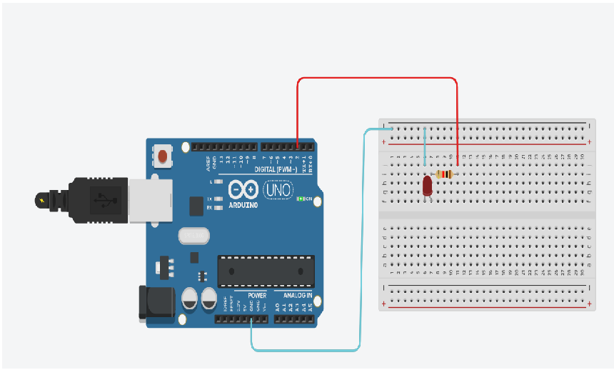

##  Projeto Circuitos no Tinkercad - arduino

## Vamos demonstrar a implementação do circuito usando um, dois e três LEDs, juntamente com a 
programação correspondente.

 [LED1] (https://github.com/pauloamoroso/ProjTinkarduino/blob/main/led1.md)

[ Tinkercad ] (https://www.tinkercad.com/)

https://github.com/pauloamoroso/ProjTinkarduino/tree/main/img/led1.png

