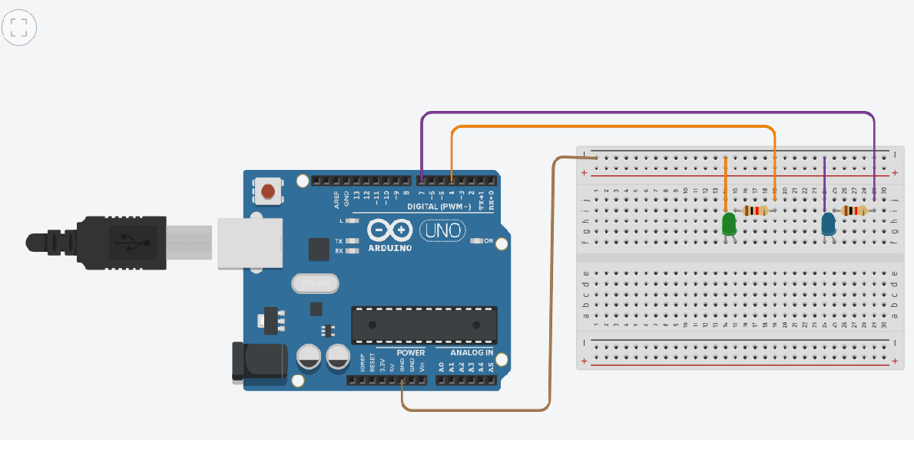

## Exercício circuito 2 leds- Tinkercad led2


 


### HARDWARE
> Arduino UNO R3

> Led


> Led

> 220 ohm  Resistência


código
```cpp
const int vermelho =2;

void setup()
{
  pinMode(vermelho, OUTPUT);
  
 
}

void loop()
  {
  
{
  digitalWrite(vermelho, HIGH);
  delay(1000); // Wait for 1000 millisecond(s)
  digitalWrite(vermelho, LOW);
  delay(1000); // Wait for 1000 millisecond(s)
}

    
}
