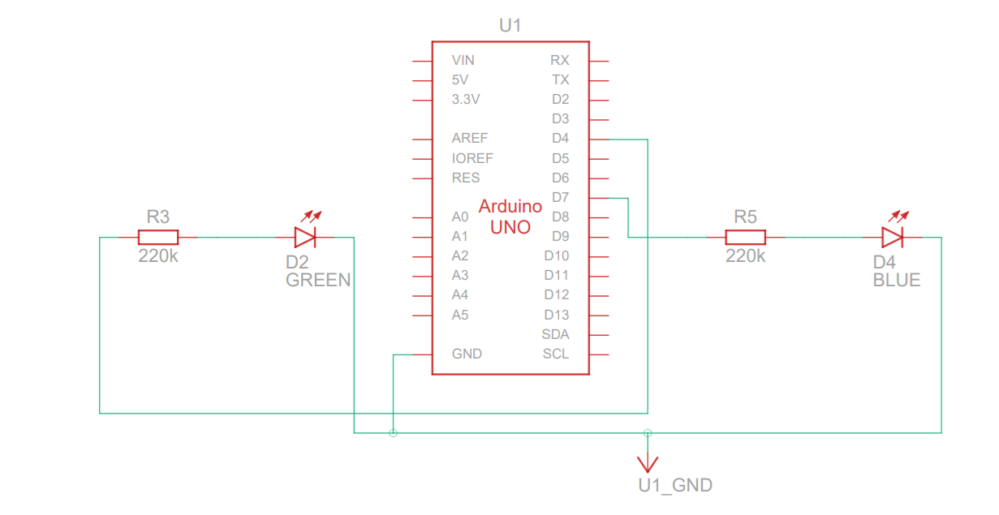

## Exercício circuito 2 leds- Tinkercad led2


 


### HARDWARE
> Arduino UNO R3

> 2 Led


> 220 ohm  Resistência


## Esquema circuito




código
```cpp
const int verde =4;
const int azul =7;


void setup()
{
 
  
  pinMode(verde, OUTPUT);
  
   pinMode(azul, OUTPUT);
}

void loop()
  {
  

{
  digitalWrite(verde, HIGH);
  delay(1000); // Wait for 1000 millisecond(s)
  digitalWrite(verde, LOW);
  delay(1000); // Wait for 1000 millisecond(s)
}
  
  {
  digitalWrite(azul, HIGH);
  delay(1000); // Wait for 1000 millisecond(s)
  digitalWrite(azul, LOW);
  delay(1000); // Wait for 1000 millisecond(s)
}
  
  
}
