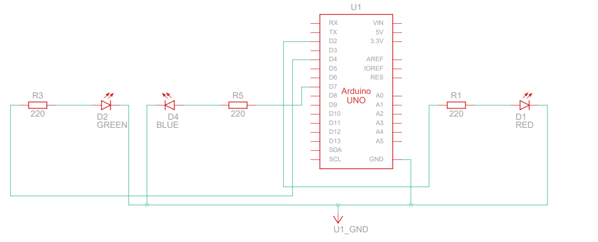

## Exercício circuito 3 leds- Tinkercad led3





 


### HARDWARE
> Arduino UNO R3

>  3 Led

> 1 kΩ Resistência

> 220 ohm  Resistência


### Esquema circuito

 


código
```cpp
// Definição de constantes para os pinos LED

// Definição de constantes para os pinos LED
const int vermelho = 2;
const int verde = 4;
const int azul = 7;

void setup() {
  pinMode(vermelho, OUTPUT);
  pinMode(verde, OUTPUT);
  pinMode(azul, OUTPUT);
}

void loop() {
  // Liga e desliga o LED vermelho
  {
    digitalWrite(vermelho, HIGH);
    delay(1000); // Espera 1000 milissegundos
    digitalWrite(vermelho, LOW);
    delay(1000); // Espera 1000 milissegundos
  }

  // Liga e desliga o LED verde
  {
    digitalWrite(verde, HIGH);
    delay(1000); // Espera 1000 milissegundos
    digitalWrite(verde, LOW);
    delay(1000); // Espera 1000 milissegundos
  }

  // Liga e desliga o LED azul
  {
    digitalWrite(azul, HIGH);
    delay(1000); // Espera 1000 milissegundos
    digitalWrite(azul, LOW);
    delay(1000); // Espera 1000 milissegundos
  }
}


